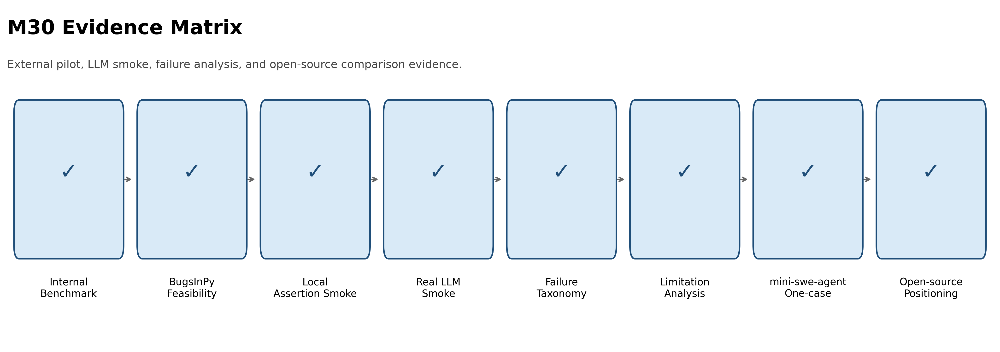
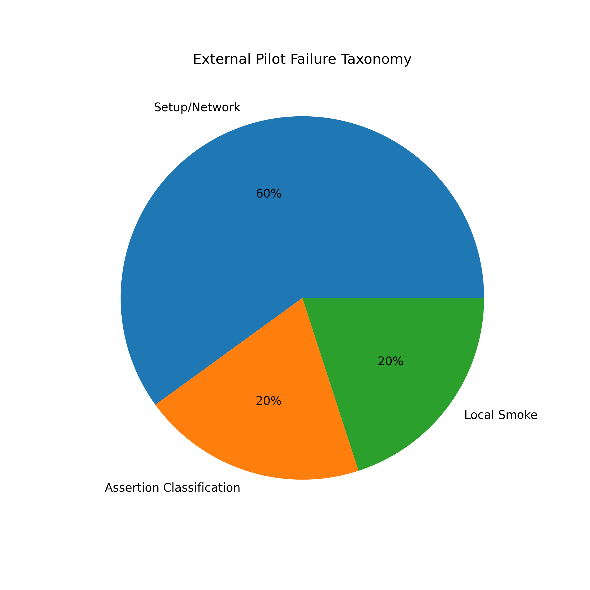
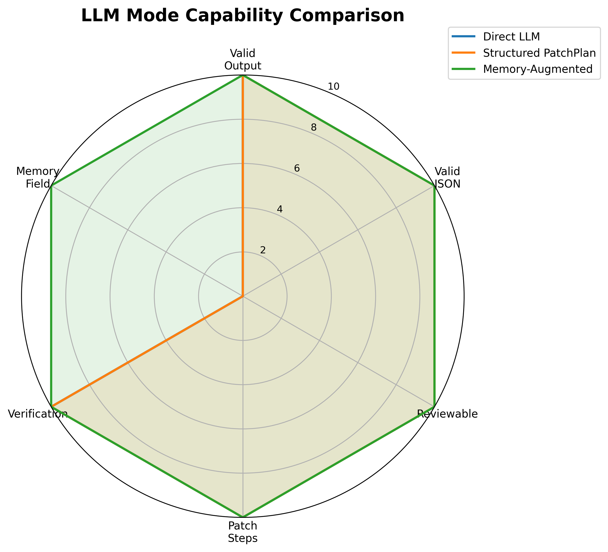
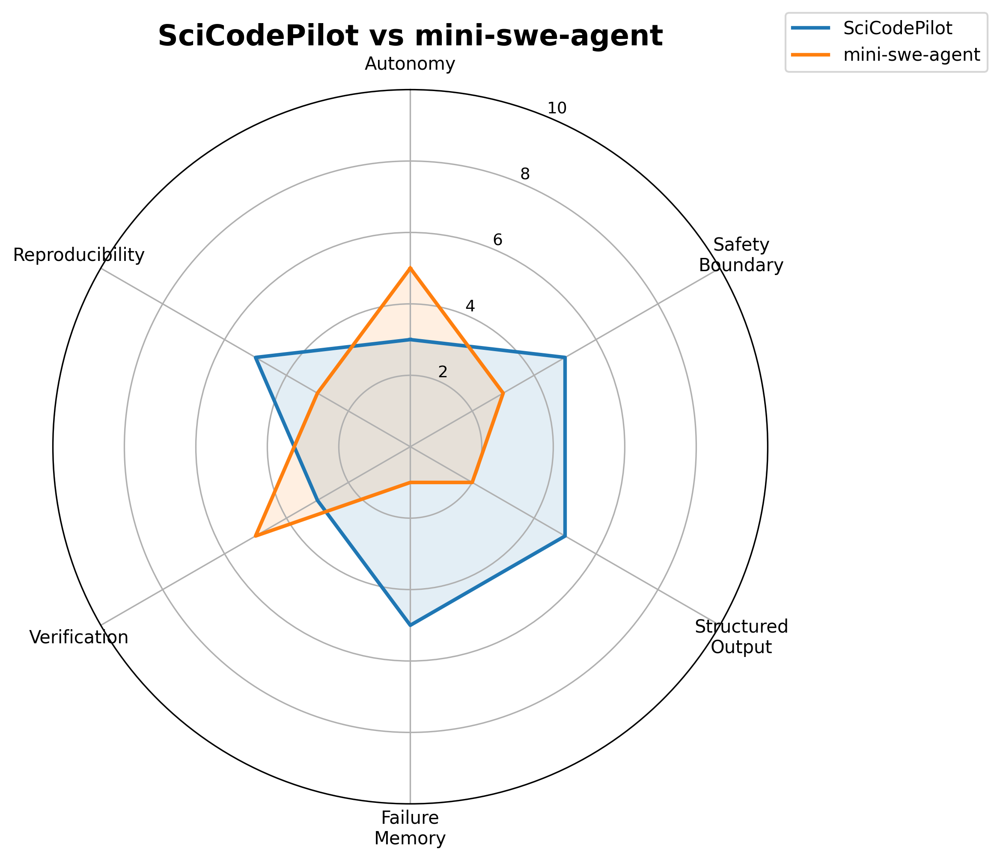
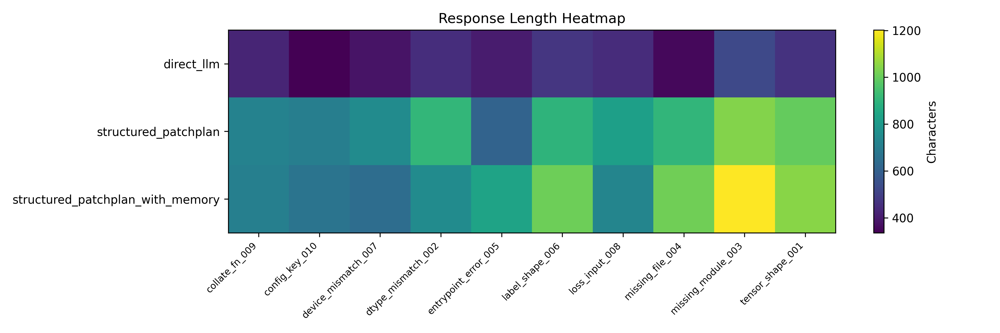
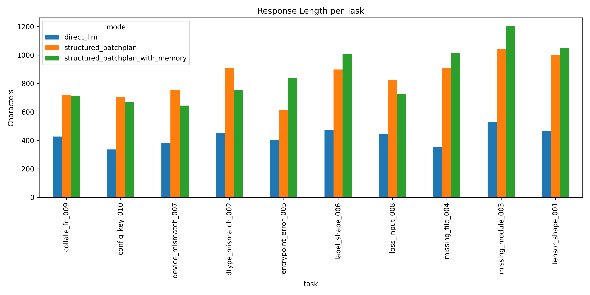

# SciCodePilot

> **SciCodePilot: Memory-Augmented Structured Agent for Reliable Scientific Code Repair and Reproducibility**

SciCodePilot 是一个面向科研 Python / 机器学习代码诊断、修复与复现的结构化 Agent 原型。项目关注的问题不是“如何让 LLM 尽可能自由地改代码”，而是：在科研代码运行失败后，能否通过结构化失败记忆、相似案例检索、安全约束补丁生成和隔离验证，构建一个比直接根据 traceback 生成 patch 更可审计、更安全、更可复现的修复流程。

本仓库实现了一个 memory-augmented structured agent pipeline：

```text
运行失败 -> 结构化 FailureMemory -> 路由判断 -> 补丁计划 / 环境计划
        -> 安全审查 -> 用户确认 -> 隔离 workspace 应用 -> 验证与记录
```

当前项目围绕 **internal controlled benchmark** 展开，强调 component-level evaluation。所有实验结果都应理解为内部受控任务上的系统链路验证，用于分析 diagnosis、routing、memory retrieval、patch planning、safety review 和 reproducibility 等组件是否按预期工作，而不代表公开 benchmark 性能或真实世界泛化能力。

## 摘要

科研代码实验常因 tensor shape、dtype、device、loss input、collate function、config key、missing dependency 和 missing data file 等问题中断。直接式 LLM patching 通常只依据当前 traceback 生成修改，缺少对错误类别、环境边界、安全风险、历史失败经验和复现实验证据的系统化建模。SciCodePilot 将一次运行失败转化为结构化 `FailureMemory`，并在此基础上进行失败类型路由、相似案例检索、受约束 `PatchPlan` 生成、安全审查和隔离验证。该设计的目标是在受控科研代码修复场景中提升修复流程的可解释性、安全性和复现性，同时避免将缺依赖、缺数据等不应自动修改源码的问题错误转化为源码 patch。

项目最终形成了一个可运行的后端 agent 系统、Textual 前端演示界面、内部受控 benchmark、memory retrieval 组件、external repo smoke interface、ablation / safety / LLM smoke 相关产物，以及用于最终报告和答辩展示的图表与 transcript。

## 目录

- [摘要](#摘要)
- [项目亮点](#项目亮点)
- [研究背景与问题](#研究背景与问题)
- [研究问题与核心假设](#研究问题与核心假设)
- [主要贡献](#主要贡献)
- [方法设计](#方法设计)
- [系统流程](#系统流程)
- [核心模块](#核心模块)
- [评测设计](#评测设计)
- [结果总览](#结果总览)
- [Benchmark 任务](#benchmark-任务)
- [前端界面](#前端界面)
- [运行模式说明](#运行模式说明)
- [目录结构](#目录结构)
- [快速开始](#快速开始)
- [Memory Retrieval](#memory-retrieval)
- [LLM Smoke 与结构化输出](#llm-smoke-与结构化输出)
- [External Repo Smoke](#external-repo-smoke)
- [输出文件与复现证据](#输出文件与复现证据)
- [推荐演示路线](#推荐演示路线)
- [报告与答辩资产](#报告与答辩资产)
- [测试](#测试)
- [安全边界与声明限制](#安全边界与声明限制)

## 项目亮点

| 能力 | 当前状态 | 说明 |
| --- | --- | --- |
| 内部 benchmark | 已实现 | 10 个受控科研代码失败任务 |
| Diagnosis 模式 | 已实现 | 解析报错并生成结构化 FailureMemory |
| Repair 模式 | 已实现 | 生成 PatchPlan / EnvRepairPlan |
| 安全审查 | 已实现 | PatchSafetyReviewer 审查所有补丁 |
| 隔离验证 | 已实现 | 在 `outputs/workspaces/` 下应用和验证 |
| Textual 前端 | 已实现 | 可视化事件流、计划树、诊断、补丁和验证结果 |
| transcript 导出 | 已实现 | 前端运行记录保存到 `outputs/frontend_logs/` |
| EnvDoctor | 已实现 | 缺依赖/缺文件走环境或数据修复建议 |
| Memory retrieval | 已实现 | 基于内部 FailureMemory 的确定性检索 |
| External smoke | 已实现接口 | 外部仓库 smoke 诊断/计划接口，不是公开 benchmark |
| LLM planner | 可选路径 | mock / prompt-building / provider adapter，默认关闭 |

## 研究背景与问题

科研 Python / 机器学习代码在实验过程中经常因为很小的运行时问题中断，例如 tensor shape 不匹配、dtype 不一致、CPU/GPU device 混用、loss 输入格式错误、`collate_fn` 返回结构不符合训练循环、配置键缺失、依赖包缺失、数据文件路径不存在等。这类错误并不总是需要复杂的算法推理，但它们很容易破坏实验复现，也很容易被普通代码助手用不安全或不可审查的方式处理。

本项目关注的问题是：

> 在科研代码修复中，能否通过结构化失败记忆、相似案例检索、安全约束补丁生成和隔离验证，构建一个比“直接把 traceback 发给 LLM 改代码”更可审计、更安全、更可复现的 Agent System？

SciCodePilot 的核心假设是：相比直接让 LLM 根据当前 traceback 自由生成 patch，先把失败转化为结构化的 `FailureMemory`，再显式区分源码问题、环境问题和数据问题，并在补丁应用前加入安全审查与隔离验证，可以让修复流程更容易解释、复查和复现。

## 研究问题与核心假设

本项目的中心研究问题可以表述为：

> 在 controlled scientific Python benchmark 与 small external smoke tests 的证据范围内，memory-augmented structured planning 是否比 direct LLM patching 更有利于提升代码修复流程的可审计性、安全性和复现性？

围绕这一问题，项目拆分出以下子问题：

| 编号 | 子问题 | 对应系统组件 |
| --- | --- | --- |
| RQ1 | 能否将原始 traceback、stdout/stderr 和运行上下文转化为稳定的结构化失败表示？ | TracebackParser、FailureMemory |
| RQ2 | 能否区分源码问题、环境问题和数据问题，避免对不应修改源码的问题生成 patch？ | EnvDoctor、routing logic |
| RQ3 | 受约束 PatchPlan 是否比自由形式 LLM patch 更便于审查和执行？ | PatchPlanner、LLM structured output |
| RQ4 | 历史 FailureMemory 检索是否能为新失败提供可复用的上下文案例？ | MemoryStore、retrieval evaluation |
| RQ5 | 安全审查与隔离验证是否能形成更完整的复现实验证据链？ | PatchSafetyReviewer、isolated workspace、verifier |

核心假设如下：

| 假设 | 内容 | 证据来源 |
| --- | --- | --- |
| H1 | 结构化 FailureMemory 能提升失败诊断结果的可读性和可复查性 | internal benchmark、event stream、transcript |
| H2 | 显式 routing 能减少将环境/数据问题误改为源码 patch 的风险 | missing module / missing file tasks、EnvRepairPlan |
| H3 | 受约束 PatchPlan 更适合进行安全审查和自动执行 | PatchReviewCreated、safety stress cases |
| H4 | 检索历史 FailureMemory 可构造更稳定的 ICL examples | memory retrieval demo / evaluation |
| H5 | isolated verification 与 manifest 输出能增强修复结果的复现性 | outputs、verification result、frontend transcript |

## 主要贡献

结合开题方案和当前实现，本项目的贡献可以概括为四类。

| 贡献 | 说明 | 当前实现状态 |
| --- | --- | --- |
| 结构化失败表示 | 提出 `FailureMemory` 作为科研代码失败的中间状态，将 traceback、stdout/stderr、运行命令和局部上下文组织为可路由、可检索、可审查、可验证的 agent state | 已实现并用于 benchmark / retrieval |
| 源码/环境/数据路由 | 构建 EnvDoctor 路由机制，区分可通过源码 patch 修复的问题与不应自动修改源码的问题 | missing dependency / missing file 已覆盖 |
| 安全约束补丁流程 | 将 patch planning、PatchSafetyReviewer、用户确认、isolated workspace verification 串成闭环 | rule-based planner 已稳定运行，LLM planner 为可选路径 |
| 评测与演示框架 | 构建 internal controlled benchmark、ablation table、safety stress cases、external smoke interface、frontend transcript 和报告图表 | 已形成可复现产物 |

这些贡献强调的是“结构化 agent pipeline 的可审计实现”，而不是“单次 patch 成功率最大化”。项目在报告和答辩中应避免把 internal controlled benchmark 的结果解释为公开基准或真实世界泛化结果。

## 方法设计

SciCodePilot 的方法设计可以分为五个层次：失败捕获、结构化理解、记忆检索、受约束决策、安全执行与验证。

### 1. 失败捕获与上下文记录

系统首先运行 benchmark task 或外部仓库命令，捕获：

- command；
- stdout；
- stderr；
- traceback；
- return code；
- task metadata；
- workspace/context summary。

这些信息不是直接交给 LLM 自由改写，而是先进入结构化解析阶段。

### 2. FailureMemory 构造

`TracebackParser` 根据 stderr / traceback 中的证据识别错误类型，并生成 `FailureMemory`。该对象保留 error type、evidence、root cause hypothesis、repair action 和运行上下文摘要。它既是当前诊断的结果，也是后续 retrieval 和 ICL prompt construction 的输入。

```text
raw failure
  -> parsed evidence
  -> error type
  -> root cause hypothesis
  -> repair action
  -> FailureMemory
```

### 3. Routing: 源码问题、环境问题与数据问题

不是所有运行失败都应该被转化为源码 patch。本项目显式区分三类问题：

| 路由类别 | 示例 | 系统行为 |
| --- | --- | --- |
| Source-code failure | shape、dtype、device、loss、collate、config | 生成 PatchPlan，并进入安全审查 |
| Environment failure | missing module / dependency | 生成 EnvRepairPlan，提示用户安装或配置环境 |
| Data failure | missing file / missing dataset | 生成 EnvRepairPlan，提示数据路径或文件缺失 |

这种路由设计体现了项目的安全边界：系统不应为了让命令通过而自动安装依赖、删除 import、伪造数据文件或修改 benchmark 预期。

### 4. Patch Planning 与 Memory-Augmented ICL

项目支持四类对比策略：

| 策略 | 说明 | 研究用途 |
| --- | --- | --- |
| rule-only planner | 仅使用规则式 PatchPlanner | 稳定、可复现的内部基线 |
| direct LLM repair | 直接让 LLM 根据 traceback 给出修改 | 对比自由形式输出的审查困难和风险 |
| LLM structured PatchPlan | 要求 LLM 输出受约束 JSON PatchPlan | 观察结构化输出是否更可审查 |
| retrieved FailureMemory + LLM structured PatchPlan | 在 planning 前检索相似历史失败，作为 ICL examples | 分析 memory augmentation 的作用 |

在结构化 PatchPlan 中，系统期望 planner 明确给出 `target_file`、`target_symbol`、`edit_type`、`rationale`、`risk_level` 和 `verification_command` 等字段。这样 patch 不再是不可控的自由文本，而是可以被 reviewer、applier 和 verifier 分别处理的中间表示。

### 5. 安全审查、应用与验证

所有 patch 在应用前必须经过 `PatchSafetyReviewer`。Reviewer 会检查 path traversal、危险 shell command、依赖安装、benchmark mutation、多文件越界修改等风险。通过审查后，patch 仍需等待用户确认，然后才会在 isolated workspace 中应用并运行 verification command。

```text
PatchPlan
  -> PatchSafetyReviewer
  -> user confirmation
  -> isolated workspace apply
  -> verification command
  -> score / manifest / transcript
```

这一设计使系统每一步都留下证据：理解阶段有 `FailureMemoryCreated`，决策阶段有 `PatchProposed` 或 `EnvRepairPlanCreated`，安全阶段有 `PatchReviewCreated`，执行阶段有 `PatchApplied`，验证阶段有 `VerificationFinished`。

### 项目定位

| 维度 | 本项目做什么 | 本项目不做什么 |
| --- | --- | --- |
| 研究目标 | 验证 structured failure-memory repair pipeline 是否可行 | 不宣称超过 SWE-agent / OpenHands / AutoCodeRover |
| 评测范围 | internal controlled benchmark + small external smoke | 不宣称完成 SWE-bench / BugsInPy |
| LLM 使用 | 作为可选 planner / structured output 组件 | 不默认让 LLM 直接任意改仓库 |
| 安全边界 | patch review + isolated workspace + transcript | 不声称是完全安全沙箱 |
| 前端目标 | 演示 agent event flow 和可审计证据 | 不追求生产级 Web IDE |

### 为什么要有 FailureMemory

`FailureMemory` 是本项目最重要的中间表示。它不是简单保存一段 traceback，而是把一次失败整理成后续模块可使用、可检索、可审查的结构化状态。

| 字段/信息 | 作用 |
| --- | --- |
| error type | 判断属于 shape、dtype、device、missing module 等哪类失败 |
| evidence | 保存 traceback / stderr 中真正支持判断的证据 |
| root cause hypothesis | 给出根因假设，方便人工复核 |
| repair action | 描述应该采取的修复方向 |
| command/context | 保留运行命令和上下文，支持复现 |
| verification result | 修复后是否通过验证，写回 memory 用于后续检索 |

这样做的好处是：前端能展示每一步的证据，后端能把不同类型的问题路由到不同模块，实验报告也能围绕结构化字段做表格和消融分析。

## 系统流程



SciCodePilot 后端通过结构化事件流驱动前端展示。核心事件包括：

| 阶段 | 事件 | 前端展示 |
| --- | --- | --- |
| 任务开始 | `TaskStarted` | 状态栏、运行摘要 |
| 计划生成 | `PlanCreated` | Execution Plan Tree |
| 命令执行 | `CommandStarted` / `CommandOutput` / `CommandFinished` | Timeline |
| 错误解析 | `ErrorDetected` | Error Card |
| 失败记忆 | `FailureMemoryCreated` | FailureMemory Card |
| 环境/数据问题 | `EnvRepairPlanCreated` | EnvRepairPlan Card |
| 补丁提出 | `PatchProposed` | Patch Card / Diff |
| 安全审查 | `PatchReviewCreated` | Safety Review Card |
| 用户确认 | `PatchApprovalRequired` | Confirm Apply 按钮 |
| 应用补丁 | `PatchApplied` | Apply Card |
| 验证 | `VerificationStarted` / `VerificationFinished` | Verification Card |
| 任务结束 | `TaskFinished` | Task Summary / Run Summary |

## 核心模块

SciCodePilot 不是一个单文件脚本，而是由多个职责明确的模块组成。前端主要消费 `BackendController` 暴露出的事件流，真正的诊断、修复、安全审查和验证都由后端模块完成。

| 模块 | 位置 | 职责 |
| --- | --- | --- |
| BackendController | `scicodepilot/backend/controller.py` | 给前端提供统一入口：列出任务、读取任务、运行任务 |
| Event Serializer | `scicodepilot/backend/event_serializer.py` | 把后端事件转成前端可消费的 dict / JSON |
| TracebackParser | `scicodepilot/tools/traceback_parser.py` | 从 stdout/stderr/traceback 中识别错误类型和证据 |
| FailureMemory | `scicodepilot/memory/` | 保存结构化失败记忆，支持检索和 prompt 构造 |
| EnvDoctor | `scicodepilot/env/` | 处理 missing dependency / missing data 这类不应直接改源码的问题 |
| PatchPlanner | `scicodepilot/repair/` | 生成受约束的补丁计划 |
| PatchSafetyReviewer | `scicodepilot/review/` | 判断 patch 是否存在危险行为或越界修改 |
| WorkspaceRunner | `scicodepilot/eval/` | 在隔离 workspace 中执行任务、应用 patch、验证结果 |
| Textual UI | `scicodepilot/frontend/textual_app.py` | 可视化任务选择、事件流、计划树、诊断卡片、补丁卡片和验证结果 |

### 模块协作方式

```text
Frontend
   |
   v
BackendController
   |
   +--> DiagnosisBenchmarkRunner
   |       +--> ShellTool
   |       +--> TracebackParser
   |       +--> FailureMemory
   |
   +--> RepairBenchmarkRunner
           +--> PatchPlanner / EnvDoctor
           +--> PatchSafetyReviewer
           +--> PatchApplier
           +--> Verifier
```

前端不需要知道每个后端内部类如何工作，只需要订阅后端事件并渲染即可。这也是项目方案中“前端与演示”部分比较适合独立完成的原因：前端的职责是把后端已经产生的结构化结果呈现清楚，而不是重新实现修复逻辑。

## 评测设计

本项目的评测设计遵循“内部受控验证为主、外部 smoke 为辅、明确声明边界”的原则。internal controlled benchmark 用于验证系统组件是否按预期协作，external repo smoke tests 用于检查系统入口和安全边界是否能迁移到少量本地仓库运行场景，但二者都不应被描述为公开 SOTA benchmark。

### 数据与任务来源

| 数据/任务来源 | 作用 | 当前定位 |
| --- | --- | --- |
| internal controlled benchmark | 提供可重复、可解释、可消融的科研代码失败任务 | component-level evaluation |
| safety stress cases | 检查 reviewer 是否能拦截危险 patch 或越界行为 | safety analysis |
| memory retrieval records | 检查 FailureMemory 是否能作为可检索 agent memory | retrieval analysis |
| LLM smoke outputs | 比较 direct LLM、structured PatchPlan、memory-augmented structured output 的可审查性 | smoke evidence，不代表真实 LLM repair benchmark |
| external repo smoke tests | 验证外部仓库入口、失败捕获和不修改原仓库的边界 | interface smoke test |

### 指标设计

项目中的指标分为定量指标和定性分析两类。

| 指标类别 | 代表指标 | 解释 |
| --- | --- | --- |
| Diagnosis | diagnosis correct、error type match、evidence quality | 衡量系统能否正确理解失败 |
| Routing | EnvRepairPlan generated、source patch avoided | 衡量是否正确区分源码、环境和数据问题 |
| Planning | plan generated、PatchPlan validity、reviewable output | 衡量 planner 输出是否结构化、可审查 |
| Safety | unsafe patch blocked、reviewer decision correct | 衡量安全审查是否拦截危险 case |
| Verification | patch applied、verification passed、score | 衡量补丁是否能在隔离 workspace 中通过验证 |
| Reproducibility | transcript、manifest、summary files | 衡量运行证据是否完整可复查 |

### 消融设置

项目建议书中提出的对比策略，在当前仓库中对应如下：

| Setting | 目的 |
| --- | --- |
| diagnosis-only | 只验证失败解析和 FailureMemory 生成 |
| repair without apply | 验证 patch planning 和 safety review，但不应用补丁 |
| full rule-based repair | 作为稳定、可复现的内部 baseline |
| direct LLM repair | 用于分析自由形式 LLM patch 的不可审查风险 |
| structured PatchPlan repair | 验证结构化输出是否更适合系统执行 |
| retrieved-memory LLM repair | 验证相似 FailureMemory 能否改善 prompt context |

### 结果解释原则

| 原则 | 说明 |
| --- | --- |
| 不夸大 benchmark | internal benchmark 是自建受控任务，不是 SWE-bench / BugsInPy |
| 不夸大 LLM 能力 | LLM smoke 更关注输出格式和可审查性，不代表真实修复性能 |
| 不忽略失败案例 | missing dependency / missing data 等 case 应展示为安全 routing 成功，而不是“没有修复” |
| 不隐藏人工确认 | Confirm Apply 是安全设计的一部分，不是多余步骤 |
| 不把前端当核心算法 | Textual UI 是演示和审计界面，核心逻辑在后端 agent pipeline |

## 结果总览

以下结果来自内部受控 benchmark 和 component-level evaluation，不应解释为公开 benchmark 或真实世界泛化结果。

| 指标 | 结果 |
| --- | --- |
| Controlled tasks | 10 |
| Diagnosis pass count | 10/10 |
| Source-code repair tasks | 8 |
| Env/data routing tasks | 2 |
| Patch plan count | 8 |
| Env repair plan count | 2 |
| Patch review count | 8 |
| Patch applied count | 8 |
| Verification success count | 8 |
| Scored task count | 8 |
| Average score | 1.0 |
| Safety stress case pass count | 10 |
| Failure memory record count | 10 |
| Memory retrieval top-1 self match | 10/10 |
| Memory retrieval top-3 error-type match | 10/10 |
| External repo smoke interface | Implemented |
| Public benchmark evaluation | Not executed |
| Real LLM evaluation | Not executed |

### 如何理解这些结果

这些数字的含义是：在项目自建的 10 个受控任务上，系统能够完成从失败捕获、错误类型识别、FailureMemory 生成、修复计划、安全审查到隔离验证的完整链路。它们更适合被用来证明“系统组件是否按设计运行”，而不是证明“系统能泛化到所有真实世界科研仓库”。

| 结果类型 | 可以说明什么 | 不能说明什么 |
| --- | --- | --- |
| Diagnosis pass | parser 和 FailureMemory schema 能覆盖内部任务 | 不能说明能识别所有真实 traceback |
| Verification success | 内部源码修复任务可以在隔离 workspace 通过验证 | 不能说明真实项目一定能自动修好 |
| Safety stress pass | reviewer 能拦截预设危险 case | 不能说明不存在任何安全漏洞 |
| Memory retrieval match | 当前 memory store 能找回相似内部案例 | 不能说明具备大规模语义检索能力 |
| External smoke interface | 有外部仓库入口和不改原仓库的边界 | 不能当作公开 benchmark 成绩 |

## Benchmark 任务

当前内部 benchmark 共 10 个任务：

| Task ID | 类型 | 处理路径 |
| --- | --- | --- |
| `repair_tensor_shape_001` | tensor shape | source-code patch |
| `repair_dtype_mismatch_002` | dtype mismatch | source-code patch |
| `repair_missing_module_003` | missing module | EnvDoctor |
| `repair_missing_file_004` | missing file | EnvDoctor |
| `repair_entrypoint_error_005` | entrypoint error | source-code patch |
| `repair_label_shape_006` | label shape | source-code patch |
| `repair_device_mismatch_007` | device mismatch | source-code patch |
| `repair_loss_input_008` | loss input | source-code patch |
| `repair_collate_fn_009` | collate function | source-code patch |
| `repair_config_key_010` | config key | source-code patch |

### 错误类型覆盖

Benchmark 分布的 Mermaid 源文件见 [`report_assets/figures/benchmark_distribution.md`](report_assets/figures/benchmark_distribution.md)。

| 错误家族 | 典型失败现象 | 系统期望行为 |
| --- | --- | --- |
| Tensor shape | tensor 维度不符合矩阵运算或 loss 要求 | 识别 shape mismatch，生成局部源码修复计划 |
| dtype mismatch | 输入或标签 dtype 与模型/loss 不兼容 | 统一 dtype，避免盲目改模型结构 |
| device mismatch | CPU 与 CUDA tensor 混用 | 将参与同一计算的对象放到同一 device |
| loss input | loss 函数输入格式不对 | 修正 logits/label 的输入形式 |
| collate function | batch 结构和训练循环预期不一致 | 对齐 dataloader 输出和训练代码 |
| config key | 配置项缺失或名称不一致 | 补齐/改正配置读取逻辑 |
| missing module | 缺少依赖包 | 生成 EnvRepairPlan，不自动 pip install |
| missing file | 缺少数据文件或路径错误 | 提示数据/路径问题，不伪造数据 |

## 前端界面

Textual 前端位于：

```text
scicodepilot/frontend/textual_app.py
scripts/run_textual_app.py
```

它展示：

- 左侧任务选择、模式选择、状态区；
- 中间 Execution Plan Tree 和 Timeline；
- 右侧 Run Summary、Diagnosis and Memory、Repair and Verification；
- 自动导出的可复制 transcript。

前端只依赖后端公开接口：

```python
from scicodepilot.backend.controller import BackendController
from scicodepilot.backend.event_serializer import event_to_dict, event_to_json
```

当前公开 API：

```python
controller.list_tasks()
controller.get_task(task_id)
controller.run_task(task_id, mode, confirm_apply=False)
```

前端不直接调用 `PatchPlanner`、`PatchApplier`、`RepairBenchmarkRunner`、`DiagnosisBenchmarkRunner` 或 `EnvDoctor`。

### 前端信息架构

Textual UI 的目标不是把终端输出简单堆在屏幕上，而是把后端事件拆成几个更适合演示和答辩的区域。

| 区域 | 内容 | 演示价值 |
| --- | --- | --- |
| 左侧控制区 | Task、Mode、Run、Confirm Apply、Status | 展示用户如何选择任务和运行模式 |
| Execution Plan Tree | 后端生成的步骤，以及事件推进状态 | 展示 agent pipeline 不是一次性 LLM 调用 |
| Timeline | 命令、stdout/stderr、事件顺序 | 展示可审计 event stream |
| Run Summary | memory、plan、review、apply、verify、transcript 状态 | 快速说明本次运行到哪一步 |
| Diagnosis and Memory | Error Card、FailureMemory Card、EnvRepairPlan Card | 展示结构化失败理解 |
| Repair and Verification | Patch Card、Safety Review、Verification、Task Summary | 展示补丁和验证证据 |

### 前端运行后的典型流程

以 `repair_device_mismatch_007` 为例：

| 模式 | 操作 | 预期现象 |
| --- | --- | --- |
| Diagnosis only | 选择 task 后点 `Run` | Timeline 出现命令失败，右侧生成 Error Card 和 FailureMemory Card |
| Repair | 选择 task 后点 `Run` | 系统生成 PatchProposed 和 PatchReviewCreated，但如果未确认不会应用 patch |
| Repair + Confirm Apply | 先 `Run` 生成 patch，再点 `Confirm Apply` | patch 在隔离 workspace 中应用，随后运行 verification |

### 前端导出内容

每次运行后，前端会把可复制 transcript 写入：

```text
outputs/frontend_logs/
```

这类 transcript 适合用于：

- 答辩时展示一条完整 agent event flow；
- 放入报告作为可复现实验记录；
- 给组员核对后端事件和前端展示是否一致；
- 避免 Textual 的 timeline 区域不能直接选中文字的问题。

## 运行模式说明

SciCodePilot 中最容易混淆的是 `diagnosis`、`repair` 和 `confirm_apply`。它们的区别如下：

| 模式/参数 | 是否生成 FailureMemory | 是否生成 PatchPlan | 是否应用 patch | 是否验证 | 适合场景 |
| --- | --- | --- | --- | --- | --- |
| `diagnosis` | 是 | 否 | 否 | 否 | 只想看错误识别和结构化记忆 |
| `repair` | 是 | 是 | 默认否 | 默认否 | 想看系统会提出什么补丁，但不真正修改 workspace |
| `repair --confirm-apply` | 是 | 是 | 是 | 是 | 想完整演示修复、应用和验证闭环 |

需要注意的是，系统应用 patch 的位置是隔离 workspace，不是直接改原始 benchmark 文件或外部仓库。这一点对项目安全边界非常重要。

## 目录结构

```text
scicodepilot-dev/
+-- benchmark/tasks/          # 内部受控 benchmark 任务
+-- docs/                     # 架构、交接、报告、答辩、前端说明
+-- external_smoke/           # 外部仓库 smoke 结果快照
+-- outputs/                  # benchmark、memory、LLM、smoke 输出
+-- report_assets/            # 报告图表和表格
+-- scicodepilot/             # 主 Python 包
|   +-- backend/              # 前端公开后端入口
|   +-- env/                  # EnvDoctor 环境/数据修复建议
|   +-- eval/                 # runner、workspace、evaluator
|   +-- events/               # 事件 schema 和 event bus
|   +-- frontend/             # Textual 前端
|   +-- llm/                  # LLM client、planner、prompt builder
|   +-- memory/               # FailureMemory、record、store
|   +-- repair/               # PatchPlan、PatchPlanner、PatchApplier
|   +-- review/               # PatchSafetyReviewer
|   +-- tools/                # ShellTool、TracebackParser
+-- scripts/                  # demo、实验、导出、smoke 脚本
+-- tests/                    # 离线测试
+-- requirements.txt
+-- README.md
```

## 快速开始

### 1. 安装依赖

```bash
pip install -r requirements.txt
```

Windows PowerShell 示例：

```powershell
cd C:\Users\user\Documents\scicodepilot\scicodepilot-dev
pip install -r requirements.txt
```

### 2. 启动 Textual 前端

```bash
python scripts/run_textual_app.py
```

smoke test：

```bash
python scripts/run_textual_app.py --smoke-test
```

### 3. 运行 showcase demo

```bash
python scripts/run_showcase_demo.py
```

### 4. 运行 benchmark suite

Diagnosis：

```bash
python scripts/run_benchmark_suite.py --mode diagnosis
```

Repair，不应用 patch：

```bash
python scripts/run_benchmark_suite.py --mode repair
```

Repair，确认应用 patch：

```bash
python scripts/run_benchmark_suite.py --mode repair --confirm-apply
```

Mock LLM planner：

```bash
SCICODEPILOT_LLM_PROVIDER=mock python scripts/run_benchmark_suite.py --mode repair --confirm-apply --use-llm-planner
```

PowerShell：

```powershell
$env:SCICODEPILOT_LLM_PROVIDER="mock"
python scripts\run_benchmark_suite.py --mode repair --confirm-apply --use-llm-planner
```

## Memory Retrieval

SciCodePilot 可以把内部 controlled benchmark 的失败转换为可检索的 memory records。

导出 FailureMemory records：

```bash
python scripts/export_failure_memory_records.py --latest
```

运行 retrieval demo：

```bash
python scripts/run_memory_retrieval_demo.py
```

运行 retrieval evaluation：

```bash
python scripts/evaluate_memory_retrieval.py --latest
```

检索评估摘要：

| 指标 | 结果 |
| --- | --- |
| total queries | 10 |
| top-1 self match | 10/10 |
| top-3 self match | 10/10 |
| top-1 error-type match | 10/10 |
| top-3 error-type match | 10/10 |



## LLM Smoke 与结构化输出

M30 产物中包含 direct LLM、structured PatchPlan、structured PatchPlan with memory 三类模式的 smoke 证据。

| Mode | Runs | API success | Valid output | Valid JSON | Reviewable | Patch steps | Memory field |
| --- | ---: | ---: | ---: | ---: | ---: | ---: | ---: |
| direct_llm | 10 | 10 | 10 | 0 | 0 | 0 | 0 |
| structured_patchplan | 10 | 10 | 10 | 10 | 10 | 10 | 0 |
| structured_patchplan_with_memory | 10 | 10 | 10 | 10 | 10 | 10 | 10 |



这些结果主要用于说明结构化 PatchPlan 更容易被审查和验证，不应被表述为真实 LLM 修复性能或公开 benchmark 结果。

## External Repo Smoke

项目包含外部仓库 smoke 入口：

```bash
python scripts/run_external_repo_smoke.py --help
```

典型形式：

```bash
python scripts/run_external_repo_smoke.py --repo-path <local_repo> --command "python test_case.py" --mode diagnosis
```

外部 smoke 的边界：

- 会复制外部仓库到隔离 workspace；
- 不应修改原始仓库；
- 主要验证入口、失败捕获、summary 输出；
- 不是 BugsInPy / SWE-bench 公开 benchmark 结果。

## 输出文件与复现证据

SciCodePilot 的一个设计重点是：每次运行不只在终端打印结果，还会留下结构化输出，方便之后复查、写报告和做答辩展示。

| 输出类型 | 典型路径 | 用途 |
| --- | --- | --- |
| benchmark run summary | `outputs/benchmark_runs/<timestamp>/summary.json` | 汇总每次 benchmark suite 的整体结果 |
| benchmark jsonl | `outputs/benchmark_runs/<timestamp>/results.jsonl` | 按任务保存 diagnosis / repair 结果 |
| isolated workspace | `outputs/workspaces/` | 应用 patch 和运行验证的临时工作区 |
| frontend logs | `outputs/frontend_logs/` | Textual 前端导出的可复制 transcript |
| memory records | `outputs/failure_memory_records/` 或 memory 相关输出目录 | 保存结构化 FailureMemory |
| retrieval output | `outputs/memory_retrieval*/` | 保存 memory retrieval prompt、summary 和评估结果 |
| LLM smoke output | `outputs/m30_llm_smoke/` | 保存 direct/structured/memory structured 三种模式的 prompt 和 response |
| external smoke output | `external_smoke/` 或 `outputs/external_smoke/` | 保存外部仓库 smoke 运行摘要 |
| report tables | `report_assets/tables/` | 报告可引用的结果表 |
| report figures | `report_assets/figures/` | 报告可引用的图 |

### 复现链路

一次完整 repair 运行通常会留下以下证据：

| 步骤 | 证据 |
| --- | --- |
| 原始运行失败 | command、stdout、stderr、return code |
| 错误解析 | `ErrorDetected` 事件和 evidence |
| 结构化记忆 | `FailureMemoryCreated` 事件 |
| 补丁计划 | `PatchProposed` 事件和 unified diff |
| 安全审查 | `PatchReviewCreated` 事件 |
| 用户确认 | `PatchApprovalRequired` / `confirm_apply=True` |
| 应用补丁 | `PatchApplied` 事件 |
| 验证结果 | `VerificationFinished` 事件 |
| 运行总结 | `TaskFinished` 和 transcript |

这种证据链是本项目区别于“直接问 LLM 怎么改”的关键：即使 patch 很小，系统也会保留为什么改、改哪里、是否安全、如何验证的记录。

## 推荐演示路线

如果用于课堂展示或组内汇报，可以按照下面的顺序演示：

| 顺序 | 内容 | 命令/操作 | 说明 |
| ---: | --- | --- | --- |
| 1 | 启动前端 | `python scripts/run_textual_app.py` | 展示 Textual UI |
| 2 | Diagnosis 示例 | 选择 `repair_device_mismatch_007`，模式选 Diagnosis only，点 Run | 展示 Error Card 和 FailureMemory |
| 3 | Repair 但不应用 | 模式选 Repair，点 Run | 展示 PatchProposed 和 Safety Review |
| 4 | Confirm Apply | 点 Confirm Apply | 展示隔离 workspace 应用 patch 和验证 |
| 5 | EnvDoctor 示例 | 选择 `repair_missing_module_003` 或 `repair_missing_file_004` | 展示系统不会盲目改源码 |
| 6 | transcript | 打开 `outputs/frontend_logs/` | 展示可复制、可归档的运行记录 |
| 7 | memory retrieval | `python scripts/run_memory_retrieval_demo.py` | 展示历史失败案例检索 |
| 8 | external smoke | `python scripts/run_external_repo_smoke.py --help` | 展示外部接口存在，但解释边界 |

前端演示时最值得强调的不是“界面多复杂”，而是每个面板都对应后端 agent pipeline 的一个阶段：理解失败、组织记忆、提出计划、审查风险、应用补丁、验证结果、保存证据。

## 报告与答辩资产

常用脚本：

```bash
python scripts/run_final_defense_demo.py
python scripts/export_component_metrics.py --latest
python scripts/export_llm_metrics.py
```

重要文档：

| 文档 | 用途 |
| --- | --- |
| `docs/architecture.md` | 系统架构 |
| `docs/final_demo_script.md` | 答辩 demo 流程 |
| `docs/final_claims_checklist.md` | 可声明/不可声明边界 |
| `docs/final_report_draft.md` | 最终报告草稿 |
| `docs/frontend_handoff_checklist.md` | 前端后端接口约定 |
| `docs/frontend_textual_ui_update_zh.md` | 前端更新中文说明 |

报告资产：

| 路径 | 内容 |
| --- | --- |
| `report_assets/figures/` | 图表图片和架构图 |
| `report_assets/tables/` | 实验表格 |
| `outputs/m30_llm_smoke/` | M30 LLM smoke prompt / response / summary |
| `outputs/memory_retrieval*/` | memory retrieval 输出 |
| `external_smoke/` | 外部仓库 smoke 结果 |



### 图表预览

| 图表 | 说明 |
| --- | --- |
| `fig1_m30_evidence_matrix.png` | M30 证据矩阵，说明每类 claim 对应哪些实验/产物 |
| `fig2_llm_mode_radar.png` | 对比 direct LLM、structured PatchPlan、memory structured PatchPlan |
| `fig3_agent_comparison_radar.png` | 和开源 agent 的定位对比 |
| `fig7_failure_taxonomy_pie.png` | failure type 分布 |
| `fig11_task_heatmap.png` | task-level 结果热力图 |
| `fig12_task_mode_comparison.png` | 不同任务/模式对比 |
| `fig13_response_distribution.png` | LLM smoke response 分布 |





## 测试

运行离线测试：

```bash
pytest -q
```

`docs/final_status.md` 中记录的期望状态约为：

```text
131 passed
```

实际数量可能随项目继续增加。

## 安全边界与声明限制

可以安全声明：

- SciCodePilot 面向 internal controlled benchmark；
- 使用结构化 `FailureMemory`；
- 区分 diagnosis 和 repair；
- 区分源码错误与环境/数据错误；
- 所有 patch 经过安全审查；
- patch 只在 isolated workspace 中应用；
- 包含 external repo smoke interface；
- 包含 deterministic memory retrieval evaluation。

需要避免的声明：

- 不声称 SOTA；
- 不声称完成 SWE-bench / BugsInPy；
- 不声称公开 benchmark 性能；
- 不声称真实世界泛化；
- 不声称完全安全沙箱；
- 不声称自动安装依赖或自动生成缺失数据；
- 不声称真实 LLM 修复性能，除非另行系统评测。

推荐项目表述：

```text
SciCodePilot 是一个 structured failure-memory agent，
用于在内部受控 scientific Python benchmark 上展示
安全、可审计、可复现的诊断与修复 pipeline。
```
