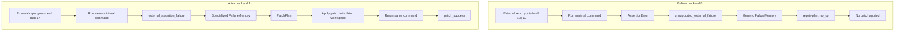

# Case 001 Flow Diagram

```mermaid
flowchart TD
    subgraph Before["Before backend fix"]
        B1["External repo: youtube-dl Bug 17"] --> B2["Run minimal command"]
        B2 --> B3["AssertionError"]
        B3 --> B4["unsupported_external_failure"]
        B4 --> B5["Generic FailureMemory"]
        B5 --> B6["repair-plan: no_op"]
        B6 --> B7["No patch applied"]
    end

    subgraph After["After backend fix"]
        A1["External repo: youtube-dl Bug 17"] --> A2["Run same minimal command"]
        A2 --> A3["external_assertion_failure"]
        A3 --> A4["Specialized FailureMemory"]
        A4 --> A5["PatchPlan"]
        A5 --> A6["Apply patch in isolated workspace"]
        A6 --> A7["Rerun same command"]
        A7 --> A8["patch_success"]
    end
```
