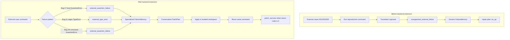

# Three Cases Flow Diagram

```mermaid
flowchart TD
    subgraph Before["Before backend extension"]
        B0["External cases 001/002/003"] --> B1["Run reproduction command"]
        B1 --> B2["Traceback captured"]
        B2 --> B3["unsupported_external_failure"]
        B3 --> B4["Generic FailureMemory"]
        B4 --> B5["repair-plan: no_op"]
    end

    subgraph After["After backend extension"]
        A0["External case command"] --> A1{"Failure pattern"}
        A1 -->|"Bug 17 bool AssertionError"| A2["external_assertion_failure"]
        A1 -->|"Bug 11 regex TypeError"| A3["external_type_error"]
        A1 -->|"Bug 29 command AssertionError"| A4["external_assertion_failure"]
        A2 --> A5["Specialized FailureMemory"]
        A3 --> A5
        A4 --> A5
        A5 --> A6["Conservative PatchPlan"]
        A6 --> A7["Apply in isolated workspace"]
        A7 --> A8["Rerun same command"]
        A8 --> A9["patch_success when return code is 0"]
    end
```
