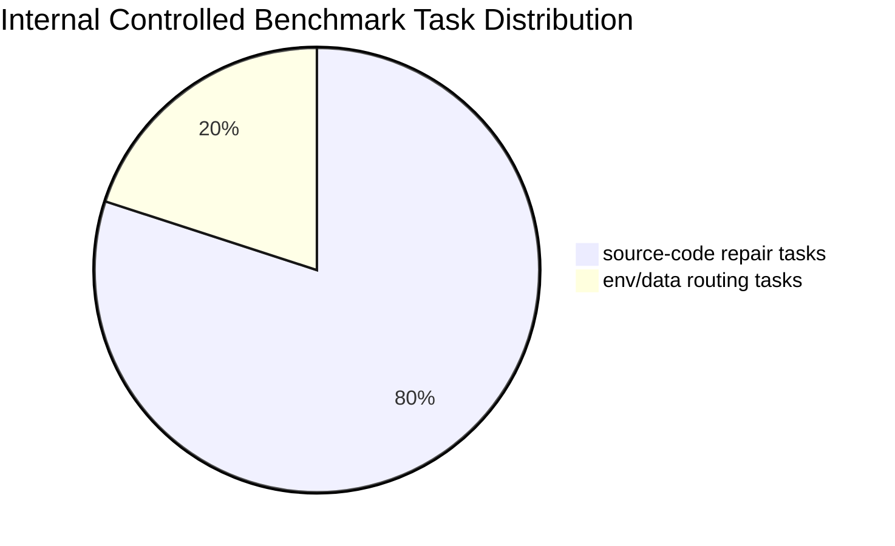

# Benchmark Distribution

| Category | Count |
| --- | ---: |
| source-code repair tasks: 8 | 8 |
| env/data routing tasks: 2 | 2 |

## Failure Types

| Failure Type | Category |
| --- | --- |
| `tensor_shape` | source-code repair |
| `dtype_mismatch` | source-code repair |
| `entrypoint_error` | source-code repair |
| `label_shape` | source-code repair |
| `device_mismatch` | source-code repair |
| `loss_input_error` | source-code repair |
| `collate_fn_error` | source-code repair |
| `config_key_error` | source-code repair |
| `missing_module` | env/data routing |
| `missing_file` | env/data routing |

Markdown/Mermaid source is available for rendering in presentation tools.
