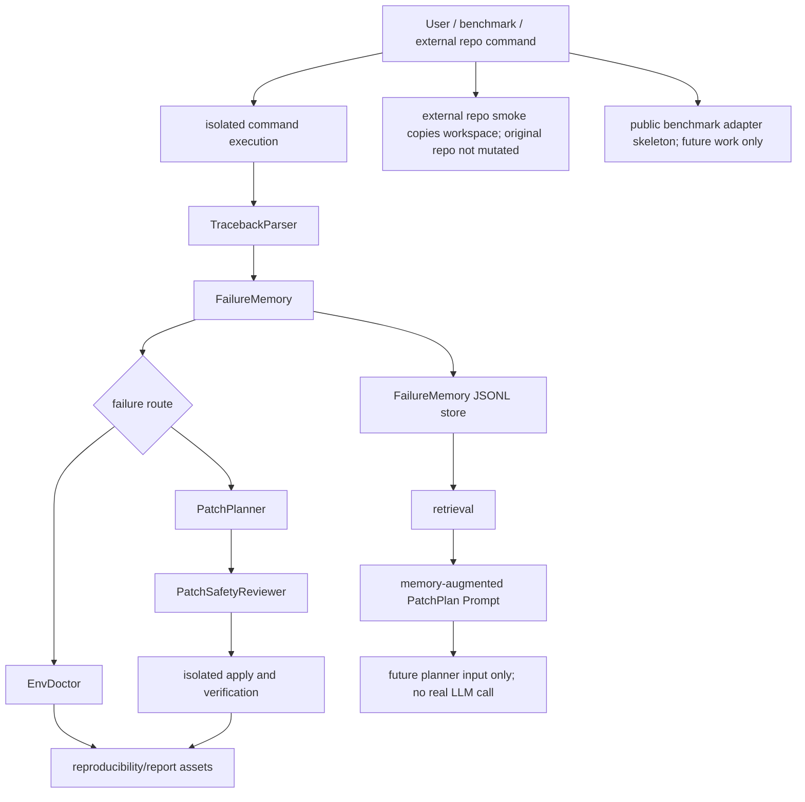

# Defense System Overview

```mermaid
flowchart TD
    A["User / benchmark / external repo command"] --> B["isolated command execution"]
    B --> C["TracebackParser"]
    C --> D["FailureMemory"]
    D --> E{"failure route"}
    E --> F["EnvDoctor"]
    E --> G["PatchPlanner"]
    G --> H["PatchSafetyReviewer"]
    H --> I["isolated apply and verification"]
    F --> J["reproducibility/report assets"]
    I --> J
    D --> K["FailureMemory JSONL store"]
    K --> L["retrieval"]
    L --> M["memory-augmented PatchPlan Prompt"]
    M --> N["future planner input only; no real LLM call"]
    A --> O["external repo smoke copies workspace; original repo not mutated"]
    A --> P["public benchmark adapter skeleton; future work only"]
```
