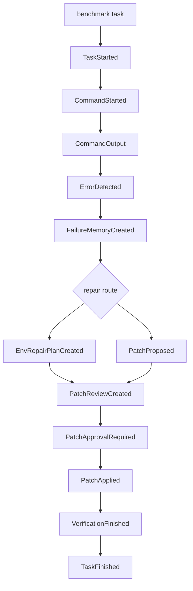

# Event Flow

```mermaid
graph TD
    A[benchmark task] --> B[TaskStarted]
    B --> C[CommandStarted]
    C --> D[CommandOutput]
    D --> E[ErrorDetected]
    E --> F[FailureMemoryCreated]
    F --> G{repair route}
    G --> H[EnvRepairPlanCreated]
    G --> I[PatchProposed]
    H --> J[PatchReviewCreated]
    I --> J
    J --> K[PatchApprovalRequired]
    K --> L[PatchApplied]
    L --> M[VerificationFinished]
    M --> N[TaskFinished]
```
