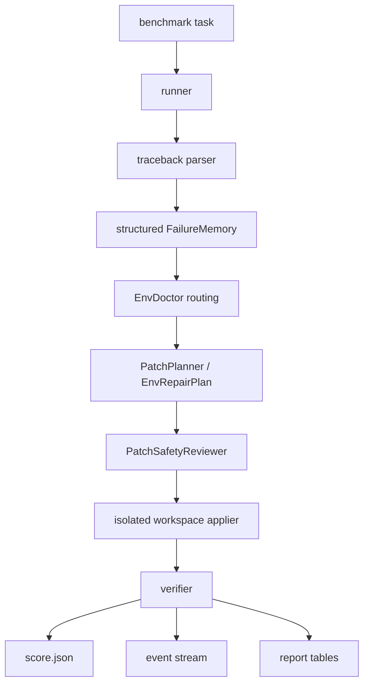

# System Pipeline

```mermaid
graph TD
    A[benchmark task] --> B[runner]
    B --> C[traceback parser]
    C --> D[structured FailureMemory]
    D --> E[EnvDoctor routing]
    E --> F[PatchPlanner / EnvRepairPlan]
    F --> G[PatchSafetyReviewer]
    G --> H[isolated workspace applier]
    H --> I[verifier]
    I --> J[score.json]
    I --> K[event stream]
    I --> L[report tables]
```
